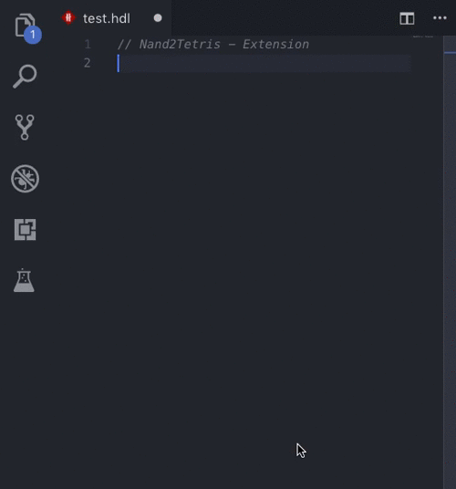
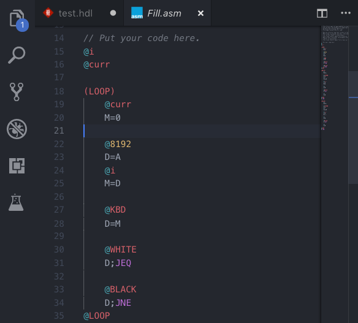
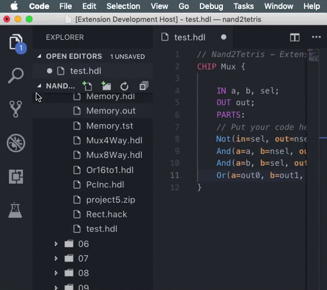

# Nand2Tetris - Extension 
## What's in it?

* **Syntax highlighting** for the HDL language and Assembly code from the [Nand2Tetris Course](https://www.nand2tetris.org/)
* **Snippets** for all gate types
* **New Icons** which allow you to find the necessary files faster

## Get up and running straight away

1. Just click install and select the icon theme `Nand2Tetris Theme`
2. Start focusing on the real tasks

## Preview

#### Of course highlighting works for your custom chips too

#### Assembly syntax

### The icons

## Known Issues

Calling out known issues can help limit users opening duplicate issues against your extension.

## Release Notes

Users appreciate release notes as you update your extension.

### 0.0.1

Beta release... feel free to open an issue if you have any problems.

-> Added syntax highlighting for .asm and .hdl

-> Added icon pack with the following icons
1. .asm
2. .hdl
3. .hack
4. .cmp
5. .tst
6. .out

-------------------------------------
**Enjoy!**